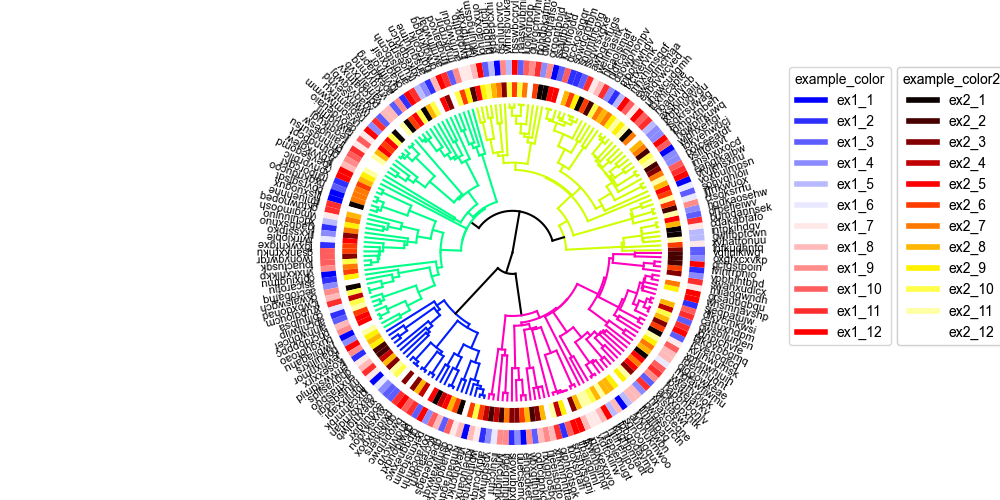

# radialtree

## What is radialtree

radialtree is a python module to draw a circular dendrogram using a output from scipy dendrogram.


## Install
```bash
git clone https://github.com/koonimaru/radialtree.git
cd radialtree
pip install .
```
Please note that radialtree is now integreated into [omniplot](https://github.com/koonimaru/omniplot) module with an improvement. 


## Example usage
```python
import scipy.cluster.hierarchy as sch
import numpy as np
import radialtree as rt

np.random.seed(1)
labels=[chr(i)*10 for i in range(97, 97+numleaf)]
x = np.random.rand(numleaf)
D = np.zeros([numleaf,numleaf])
for i in range(numleaf):
    for j in range(numleaf):
        D[i,j] = abs(x[i] - x[j])

# Compute and plot the dendrogram.
Y = sch.linkage(D, method='single')
Z2 = sch.dendrogram(Y,labels=labels,no_plot=True)

# plot a circular dendrogram
rt.plot(Z2)
```
## Example usage 2 (adding color labels to the tree.)
```python
import scipy.cluster.hierarchy as sch
import numpy as np
import radialtree as rt
np.random.seed(1)
numleaf=200
_alphabets=[chr(i) for i in range(97, 97+24)]
labels=sorted(["".join(list(np.random.choice(_alphabets, 10))) for i in range(numleaf)])
x = np.random.rand(numleaf)
D = np.zeros([numleaf,numleaf])
for i in range(numleaf):
    for j in range(numleaf):
        D[i,j] = abs(x[i] - x[j])
    
#optionally leaves can be labeled by colors
type_num=12 # Assuming there are 12 known types in the sample set
_cmp=cm.get_cmap("bwr", type_num) # Setting 12 different colors 
_cmp2=cm.get_cmap("hot", type_num) # Setting another 12 different colors
colors_dict={"example_color":_cmp(np.random.rand(numleaf)),  # RGB color list. the order of colors must be same as the original sample order.
             "example_color2":_cmp2(np.random.rand(numleaf))} # Another RGB color list.

#optionally, specify the legend of the color labels.     
colors_legends={"example_color":{"colors":_cmp(np.linspace(0, 1, type_num)), 
                                 "labels": ["ex1_"+str(i+1) for i in range(type_num)]},
                "example_color2":{"colors":_cmp2(np.linspace(0, 1, type_num)),
                                  "labels": ["ex2_"+str(i+1) for i in range(type_num)]}}
    
# Compute and plot the dendrogram.

Y = sch.linkage(D, method='single')
Z2 = sch.dendrogram(Y,labels=labels,no_plot=True)
rt.plot(Z2, colorlabels=colors_dict,colorlabels_legend=colors_legends)
```


## Example usage 3 (adding color labels to the tree automatically (rather simpler than Example 2).)
```python
import scipy.cluster.hierarchy as sch
import numpy as np
import radialtree as rt
np.random.seed(1)

numleaf=200
_alphabets=[chr(i) for i in range(97, 97+24)]
labels=sorted(["".join(list(np.random.choice(_alphabets, 10))) for i in range(numleaf)])
x = np.random.rand(numleaf)
D = np.zeros([numleaf,numleaf])
for i in range(numleaf):
    for j in range(numleaf):
        D[i,j] = abs(x[i] - x[j])
        
Y = sch.linkage(D, method='single')
Z2 = sch.dendrogram(Y,labels=labels,no_plot=True)
type_num=6
type_list=["ex"+str(i) for i in range(type_num)]
sample_classes={"example_color": [np.random.choice(type_list) for i in range(numleaf)]}
rt.plot(Z2, sample_classes=sample_classes)
```
